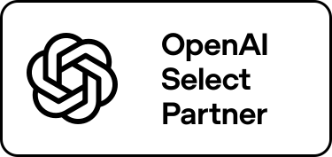

  <picture>
    <source media="(prefers-color-scheme: dark)" srcset="assets/hero-dark.svg">
    
  </picture>

Kuliberda Labs is a one-person consultancy in Kraków, run by Dawid Kuliberda. I build AI agents and n8n automations for Polish service firms. The agent prepares the drafts and keeps track of deadlines. A person at the firm approves what goes out.

Po polsku: oferta i kontakt na [kuliberda.ai](https://kuliberda.ai).

## n8n workflow templates

14 templates, each accepted through n8n's human review and published on [n8n Creators](https://n8n.io/creators/klabs/). Source for all of them lives in [n8n-sme-workflows](https://github.com/kuliberdalabs/n8n-sme-workflows).

**Finance**

- `02` Invoice dunning: idempotent invoices and payment reminders. [n8n](https://n8n.io/workflows/18054-send-idempotent-invoices-and-payment-reminders-with-gmail-and-n8n-data-tables/) · [source](https://github.com/kuliberdalabs/n8n-sme-workflows/tree/main/workflows/02-invoice-dunning)
- `06` Bank reconciliation: matches bank payments to invoices. [n8n](https://n8n.io/workflows/18420-reconcile-bank-payments-to-invoices-with-webhooks-gmail-and-data-tables/) · [source](https://github.com/kuliberdalabs/n8n-sme-workflows/tree/main/workflows/06-bank-reconciliation)
- `07` KSeF exception desk: handles exceptions from Poland's e-invoicing system. [n8n](https://n8n.io/workflows/18704-handle-ksef-e-invoice-exceptions-with-webhooks-gmail-and-data-tables/) · [source](https://github.com/kuliberdalabs/n8n-sme-workflows/tree/main/workflows/07-ksef-exception-desk)
- `14` CRM and invoicing reconciliation: keeps owner fields in sync across both systems. [n8n](https://n8n.io/workflows/19412-reconcile-crm-and-invoicing-owner-fields-with-https-apis-and-data-tables/) · [source](https://github.com/kuliberdalabs/n8n-sme-workflows/tree/main/workflows/14-crm-invoicing-reconciliation)

**Client lifecycle**

- `01` Lead intake: qualifies and routes inbound leads. [n8n](https://n8n.io/workflows/17741-qualify-and-route-consulting-leads-with-openai-airtable-and-gmail/) · [source](https://github.com/kuliberdalabs/n8n-sme-workflows/tree/main/workflows/01-lead-intake)
- `08` Client onboarding saga: coordinates a multi-step onboarding. [n8n](https://n8n.io/workflows/18626-coordinate-client-onboarding-sagas-via-webhook-data-tables-and-gmail/) · [source](https://github.com/kuliberdalabs/n8n-sme-workflows/tree/main/workflows/08-client-onboarding-saga)
- `09` Booking lifecycle: replay-safe kickoff bookings in Google Calendar. [n8n](https://n8n.io/workflows/18741-create-replay-safe-client-kickoff-bookings-with-google-calendar-gmail-and-data-tables/) · [source](https://github.com/kuliberdalabs/n8n-sme-workflows/tree/main/workflows/09-booking-lifecycle)
- `11` Quote and offer: fixed-price quotes that go out after approval. [n8n](https://n8n.io/workflows/18873-send-fixed-price-client-quotes-with-approvals-using-gmail-and-data-tables/) · [source](https://github.com/kuliberdalabs/n8n-sme-workflows/tree/main/workflows/11-quote-offer)
- `12` Client report: prepares report drafts in Gmail for review. [n8n](https://n8n.io/workflows/19006-create-replay-safe-client-report-gmail-drafts-with-webhooks-and-data-tables/) · [source](https://github.com/kuliberdalabs/n8n-sme-workflows/tree/main/workflows/12-client-report-engine)

**Operations**

- `03` Document intake: classifies and files inbound documents. [n8n](https://n8n.io/workflows/18351-classify-and-file-inbound-documents-with-gpt-4o-mini-and-gmail/) · [source](https://github.com/kuliberdalabs/n8n-sme-workflows/tree/main/workflows/03-document-intake)
- `04` Support triage: sorts tickets and drafts replies for a person to check. [n8n](https://n8n.io/workflows/17988-triage-support-tickets-and-draft-safe-replies-with-openai-gmail-and-data-tables/) · [source](https://github.com/kuliberdalabs/n8n-sme-workflows/tree/main/workflows/04-support-triage)
- `05` Ops digest: a daily digest plus alerts on items left open too long. [n8n](https://n8n.io/workflows/18148-send-daily-ops-digests-and-age-based-anomaly-alerts-with-openai-and-gmail/) · [source](https://github.com/kuliberdalabs/n8n-sme-workflows/tree/main/workflows/05-ops-digest-alert)
- `10` Order status: order tracking with email alerts. [n8n](https://n8n.io/workflows/18823-track-secure-order-status-and-email-alerts-with-webhooks-gmail-and-data-tables/) · [source](https://github.com/kuliberdalabs/n8n-sme-workflows/tree/main/workflows/10-order-status-tracker)
- `13` Complaint SLA: tracks complaint deadlines and escalations. [n8n](https://n8n.io/workflows/19315-track-complaint-slas-and-escalation-alerts-with-gmail-and-data-tables/) · [source](https://github.com/kuliberdalabs/n8n-sme-workflows/tree/main/workflows/13-complaint-sla-intake)

Hardening work is tracked in the [closed issues](https://github.com/kuliberdalabs/n8n-sme-workflows/issues?q=is%3Aissue+is%3Aclosed): replay-safe webhooks, compare-and-set stop-on-paid, fail-closed persistence, outbox emails.

## Also open source

**[brand-writing-os](https://github.com/kuliberdalabs/brand-writing-os)**: evidence-first brand writing and claim auditing for AI agents.

Video tooling: [ffmpeg-reel-montage](https://github.com/kuliberdalabs/ffmpeg-reel-montage) · [remotion-shorts-templates](https://github.com/kuliberdalabs/remotion-shorts-templates) · [video-agent-skills](https://github.com/kuliberdalabs/video-agent-skills)

---

[kuliberda.ai](https://kuliberda.ai) · [LinkedIn](https://www.linkedin.com/in/dawid-kuliberda) · Kraków, Poland
